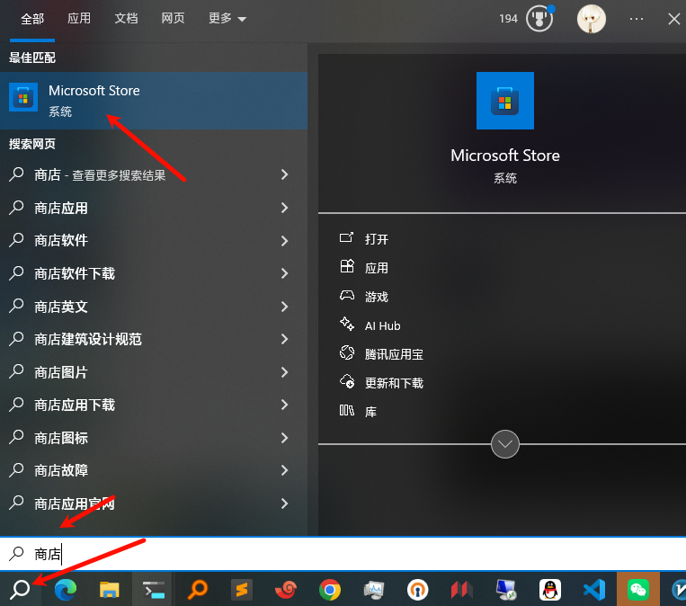
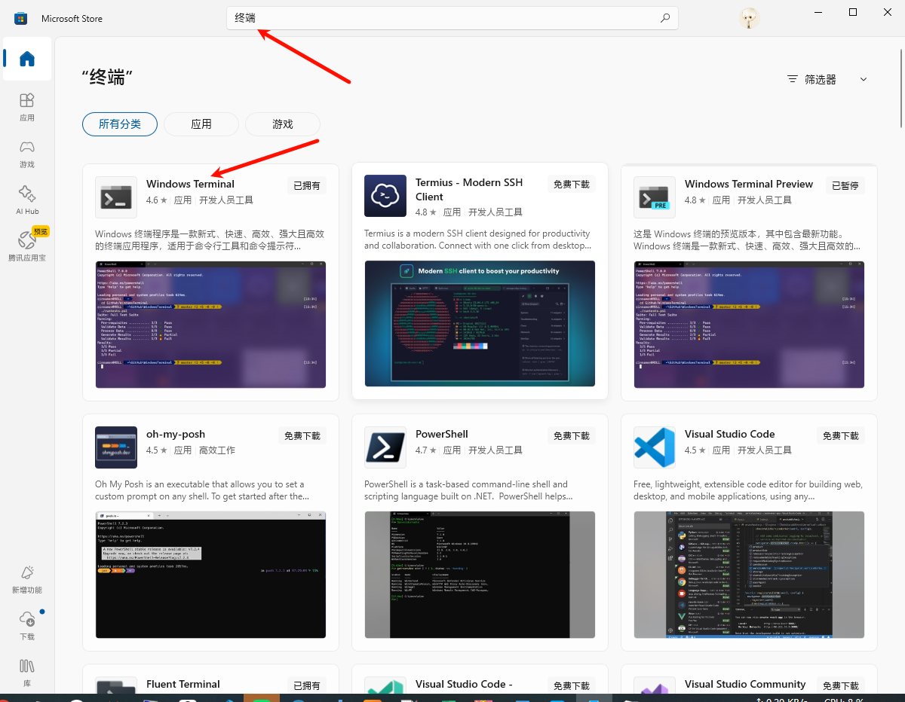
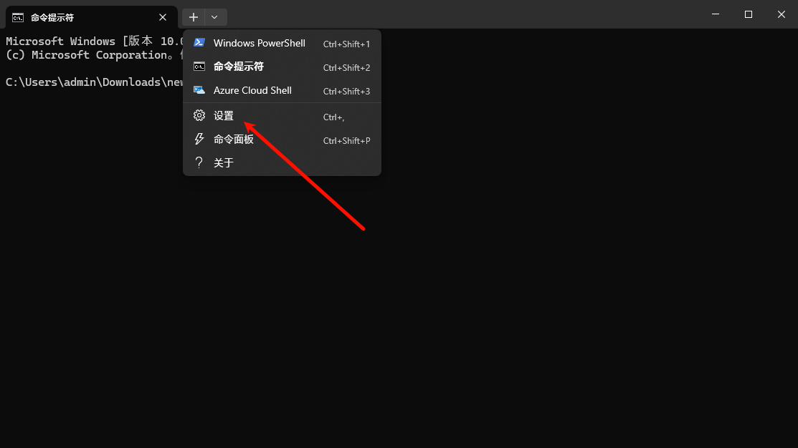
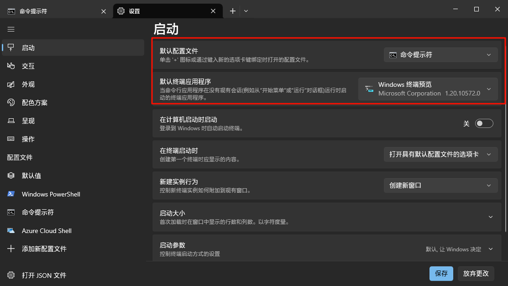
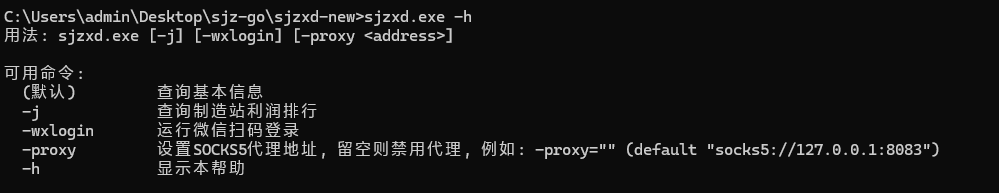
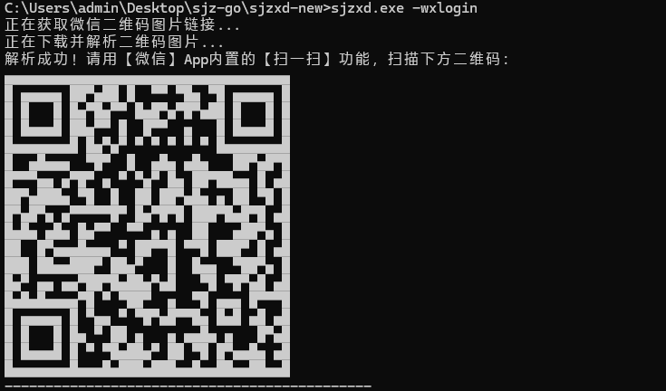
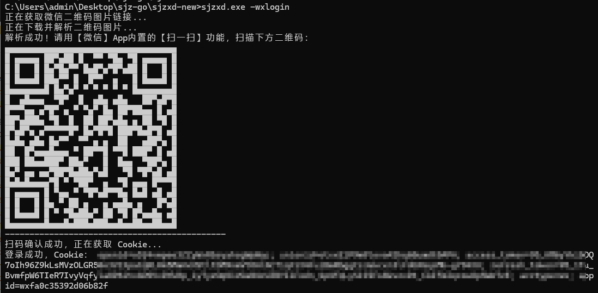
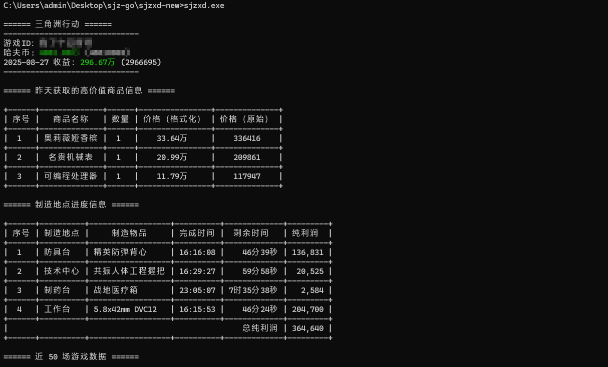
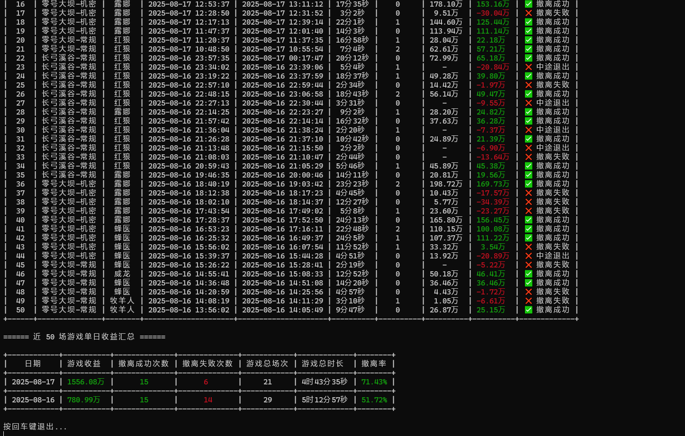
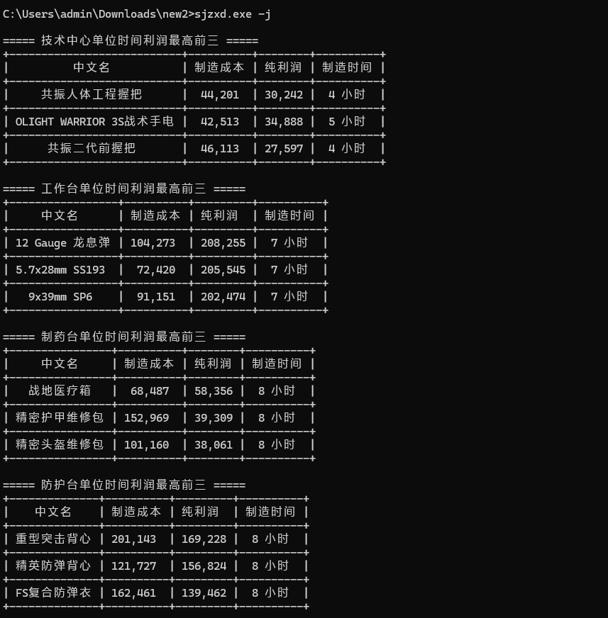

# sjzxd-tools
# 使用说明

三角洲小程序数据比较多，看不同的数据要点击不同的功能，对于我来说有点繁琐，而且不能实时统计数据，所以编写了该脚本，将所有数据都汇聚到一起并进行处理和整合。

## 1.前提说明

建议使用 **Windows Terminal** 作为运行脚本的终端，因为在脚本中加了颜色和图标，使用其他的终端可能会造成乱码。

现在搜索中找输入**商店**



在输入**终端**   下载**Windows Terminal** 



配置







**建议：因为获取的数据比较多，建议在运行脚本前将终端全屏，数据展示效果会更好**


## 2.基本使用

### 2.1 使用说明



### 2.2 微信扫码登录

```
sjzxd.exe -wxlogin
```



使用 **微信** 扫码之后即可获取cookie




注意：通过测试发现微信的cookie只能用一天，之前我用QQ账号的时候抓一次cookie都能用七八天


暂时只支持微信登录，QQ登录问题暂时未解决


### 2.4 基本信息查询

通过脚本获取了基本信息，例如：昨天获取的高价值商品信息、制造地点进度信息、近 50 场游戏数据、近 50 场游戏单日收益汇总





### 2.4 特勤处时间利润最高前三

```
sjzxd.exe -j
```



## 3.更新说明

[+] 2025.8.27     1.优化代码逻辑

​                             2.新增微信二维码在控制台输出，减少用户操作

​							 3.增加socks代理，方便调试和抓包

[+] 2025.8.22 支持统计制造中心统计单个利润和总利润

[+] 2025.8.19 支持微信扫码登录
