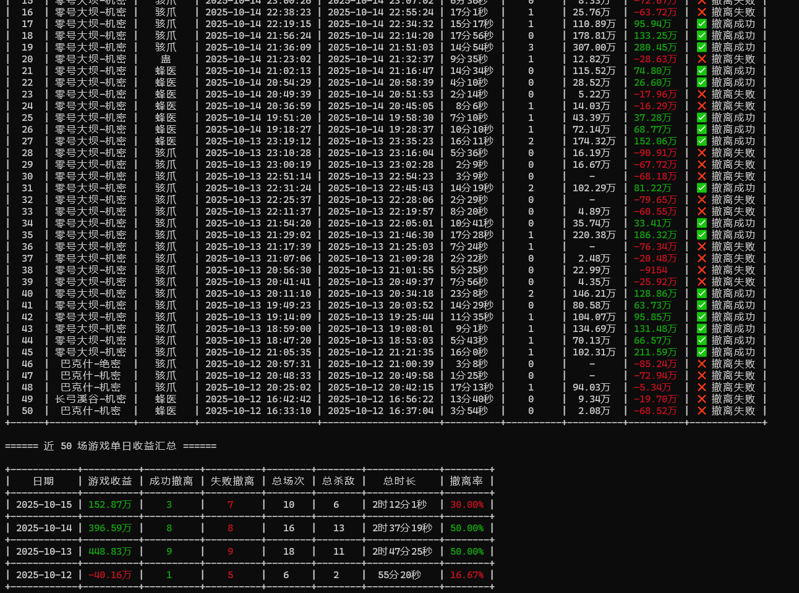

# sjzxd-tools

# 使用说明

三角洲小程序数据比较多，看不同的数据要点击不同的功能，对于我来说有点繁琐，而且不能实时统计数据，所以编写了该脚本，将所有数据都汇聚到一起并进行处理和整合。

**本脚本的常用功能就是输出当前战绩，让鼠鼠玩家知道自己的亏损，知道自己近期的战损比**

## 1.前提说明

建议使用 **Windows Terminal** 作为运行脚本的终端，因为在脚本中加了颜色和图标，使用其他的终端可能会造成乱码。

现在搜索中找输入**商店**


在输入**终端**   下载**Windows Terminal** 


配置


**建议：因为获取的数据比较多，建议在运行脚本前将终端全屏，数据展示效果会更好**


## 2.基本使用

### 2.1 使用说明


### 2.2 扫码登录

#### 微信扫码

```
sjzxd.exe -wxlogin
```


#### QQ扫码


### 2.4 基本信息查询

通过脚本获取了基本信息，例如：基本信息、生涯总览、KD统计、昨天获取的高价值商品信息、制造地点进度信息、近 50 场游戏数据、近 50 场游戏单日收益汇总等





### 2.4 特勤处时间利润最高前三和今日密码

```
sjzxd.exe -j
```


## 3.更新说明

[+] 2025.10.16

  1.增加 生涯总览、KD统计、增加单日总杀敌次数
  2.修复 近50场游戏数据 开始时间的bug

[+] 2025.10.13 

  1.增加QQ登录获取战绩信息等
  2.修改微信逻辑，扫码一次cookie可以使用很久不像之前很短时间就失效了
  3.增加 今日密码 

[+] 2025.8.27    
  1.优化代码逻辑
  2.新增微信二维码在控制台输出，减少用户操作
  3.增加socks代理，方便调试和抓包

[+] 2025.8.22 支持统计制造中心统计单个利润和总利润

[+] 2025.8.19 支持微信扫码登录
